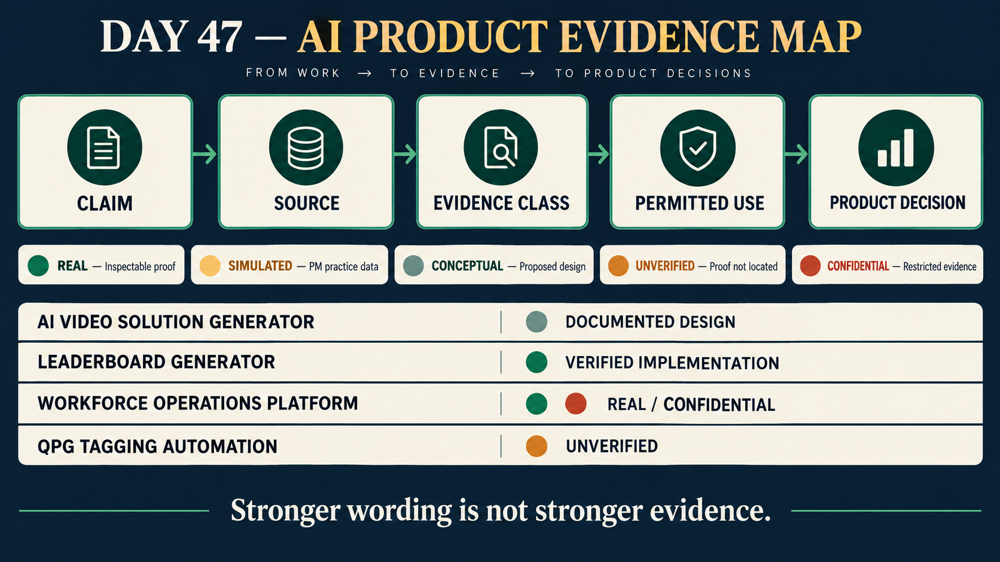

# Day 47 - Product Truth Architecture

**Date:** 10 September 2026

**Theme:** Portfolio architecture and repository truth

**Canonical location:** AI Product Manager Learning/AI PM/Day_47_Product_Evidence_Architecture/

## Objective

Day 47 converts the portfolio from a collection of documents into a controlled evidence system. The goal is not to make every project sound shipped. The goal is to make every important claim traceable, appropriately qualified, and useful in a product decision or professional conversation.

> Product claim -> source -> evidence classification -> permitted use -> product decision

If any link is missing, the claim does not become a public achievement.

## Why product truth is an AI PM capability

AI products create unusual evidence risks. A working model can exist without creating user value. A high benchmark score can coexist with low acceptance. A workflow can be well designed without being implemented. A simulated experiment can improve PM judgment without proving a production result.

An AI Product Manager therefore needs two architectures:

1. The product architecture that explains how the system works.
2. The truth architecture that explains what is known, how it is known, and what remains uncertain.

This protects decisions from treating a feature description as implementation proof, simulated metrics as real outcomes, or a target as a validated result.

## Evidence classification

| Class | Day 47 definition | Required handling |
|---|---|---|
| **REAL** | Directly supported by accessible code, tests, or an existing repository artifact. | State exactly what the source proves. Do not automatically infer adoption, ownership, deployment, or impact. |
| **SIMULATED** | Data or a scenario deliberately created for learning and PM practice. | Use the label **"Simulated learning data - created for PM practice."** Never present it as customer or production evidence. |
| **CONCEPTUAL** | A proposed workflow, architecture, framework, or integration that has not been implemented. | Present as design reasoning or a recommendation, not as a shipped capability. |
| **UNVERIFIED** | A claim has been described, but the current evidence base cannot independently confirm it. | Do not use as an achievement. State what proof is required. |
| **CONFIDENTIAL** | Evidence may exist, but public disclosure is restricted or permission is unclear. | Use only a sanitized description. Never expose identities, private data, internal URLs, credentials, or proprietary details. |

## Source-of-truth hierarchy

When artifacts conflict, Day 47 uses this order:

1. Accessible implementation and automated tests
2. Versioned operating artifacts or evaluation logs
3. Approved research records and raw observations
4. PRDs, architecture documents, and decision records
5. Learning exercises and simulations
6. Descriptions without accessible proof

Higher-ranked evidence can confirm a narrow claim. It cannot prove a broader claim without additional evidence. Code can prove that an approval state is implemented; it cannot by itself prove adoption or time saved.

## Portfolio truth by product

### AI Video Solution Generator

**Portfolio role:** Flagship case study

**Evidence:** **REAL documentation** plus **CONCEPTUAL** product and AI-system design

The repository contains a product vision, discovery summary, PRD, requirements, system and RAG architecture, evaluation framework, experimentation plan, analytics framing, and product decisions. These support the claim that an education-specific, faculty-first AI workflow has been designed and documented.

The repository does not contain implementation source, deployment proof, completed evaluation runs, research transcripts, participant counts, production telemetry, adoption data, or validated outcomes. Therefore:

- product design and PM reasoning are portfolio-safe;
- implementation and deployment are **UNVERIFIED**;
- Day 43-46 numerical examples are **SIMULATED**;
- proposed RAG benefits and architecture outcomes are **CONCEPTUAL** until tested.

The strongest defensible decision is the human-review gate. It is a documented requirement and product judgment, not proof of production behaviour.

### NGMC CheckIn / Workforce Operations Platform

**Portfolio role:** Secondary case study

**Evidence:** **REAL** implementation with **CONFIDENTIAL** disclosure boundaries

Accessible local code supports attendance, check-in/check-out, timers, projects, assignments, approvals, role controls, reporting, AI-efficiency views, and automated checks. It supports a sanitized story around workflow architecture, roles, auditability, recovery, and operational controls.

It does not support public claims about current production use, user count, adoption, time saved, revenue, or business impact. Ownership and disclosure permission must be confirmed before stronger professional claims are used.

### Leaderboard Generator

**Portfolio role:** Supporting project

**Evidence:** **REAL** implementation

Accessible Python code, tests, and documentation support spreadsheet ingestion, explicit ranking and absence rules, analytics, editable PowerPoint generation, configurable views, batch processing, and edge-case handling.

This demonstrates implementation and product-decision capability. It does not prove adoption, revenue, or time savings. A public demonstration should use synthetic data and approved branding.

### QPG Tagging Automation

**Portfolio role:** Evidence-pending product

**Evidence:** **UNVERIFIED**

The described workflow includes spreadsheet bulk tagging, taxonomy-constrained AI suggestions, PDF tag extraction, bulk video attachment, a dry run, and an explicit WRITE action. No source or sanitized demonstration was located.

Proof requires source or a packaged application, a synthetic-data demonstration, version history, validation of taxonomy and write controls, and a reproducible timing study.

## Product ecosystem boundary

The repository documents a possible educational workflow:

> question preparation -> source identification -> video drafting -> faculty review -> controlled output -> operational analysis

This is **CONCEPTUAL**. No accessible integration code proves that the tagging, video-generation, and workforce systems exchange data or operate as one deployed platform. Leaderboard Generator remains independent.

## Claim publication rules

| Claim type | Portfolio | Resume | Public professional content | Interview |
|---|---|---|---|---|
| REAL implementation | Yes, with source scope | Yes, permission-safe | Yes | Yes |
| REAL documentation/design | Yes, labeled as design | Yes, phrased as designed/documented | Yes, as reasoning | Yes |
| SIMULATED result | Only with explicit label | No | No | Practice only |
| CONCEPTUAL architecture | Yes, labeled as proposed | Only as design capability | Yes, clearly conceptual | Yes |
| UNVERIFIED claim | Evidence-status note only | No | No | Only with qualification |
| CONFIDENTIAL evidence | Sanitized summary only | Sanitized | Sanitized or omitted | Without sensitive details |

## Decision protocol

Before using a claim, I will answer:

1. What exactly am I claiming?
2. Which source directly supports it?
3. What does that source not prove?
4. What is its evidence class?
5. Is the wording narrower than or equal to the proof?
6. Can a reviewer inspect or reproduce the evidence?
7. Does publication create privacy or confidentiality risk?
8. What decision can legitimately follow?

## Worked example

**Claim considered:** "The AI Video Solution Generator reduced production time."

**Source check:** Day 43-46 contain a 120-to-65-minute comparison, but the Evidence Register classifies it as simulated learning data.

**Classification:** **SIMULATED**

**Decision:** Reject the statement as a real outcome.

**Truthful replacement:** "Designed a faculty-review AI video workflow and measurement plan covering production time, acceptance, rework, quality, latency, and cost."

## Interview-ready takeaway

> I separate the existence of an artifact from the strength of its evidence. For each claim, I identify the source, classify what it proves, state the boundary, and decide where it can be used. This lets me discuss implementation, documented design, simulation, and uncertainty without overstating outcomes.

## Day 47 outcome

The portfolio now has an explicit evidence architecture. The next improvement is not stronger wording; it is stronger proof through sanitized implementation artifacts, approved research records, versioned evaluations, telemetry, and authorized outcomes.
